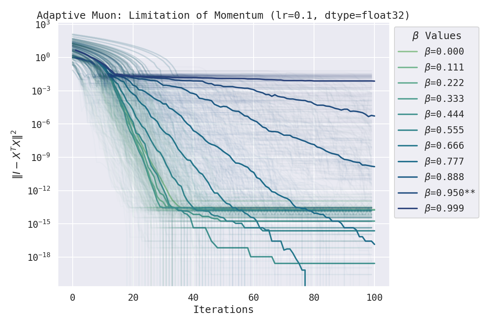
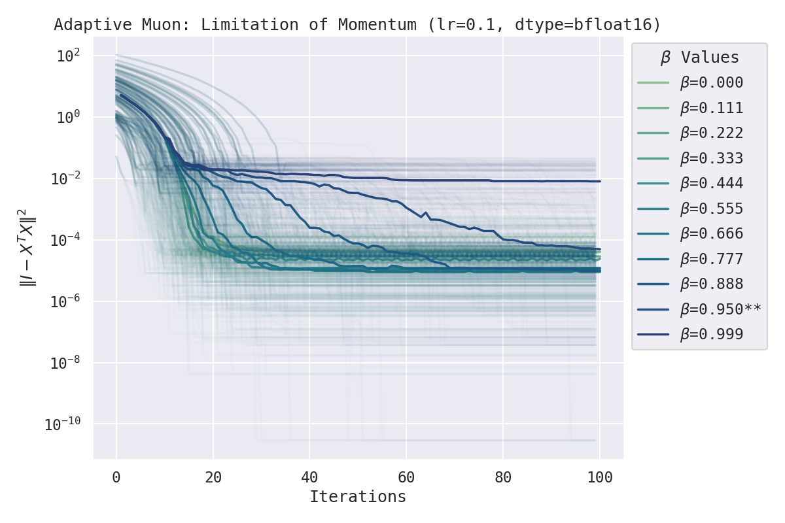

# Adaptive Muon [WIP]

A one-line modification to [@KellerJordan](https://github.com/KellerJordan)'s [Muon optimizer](https://github.com/KellerJordan/modded-nanogpt) that allows the optimizer to adapt to the scale of the gradients as they change during training. This is done by scaling the orthogonalized gradient by the dual norm of the original gradient. The justification for this can be found in [@jxbz](https://github.com/jxbz)'s and co's papers, [Old Optimizer, New Norm: An Anthology](https://arxiv.org/abs/2409.20325) and [Modular Duality in Deep Learning](https://arxiv.org/abs/2410.21265).

The following is the one-line diff to the original implementation. Note however, that all of my benchmarks were done using [my JAX implementation](https://github.com/google-deepmind/optax/pull/1126) and so there may be slight differences in performance & stability between the two implementations.

```diff
def zeropower_via_newtonschulz5(G, steps):
    assert len(G.shape) == 2
    a, b, c = (3.4445, -4.7750,  2.0315)
    X = G.bfloat16()
    # Ensure spectral norm is at most 1
    X = X / (X.norm() + 1e-7)

    if G.size(0) > G.size(1):
        X = X.T

    # Perform the NS iterations
    for _ in range(steps):
        A = X @ X.T
        B = b * A + c * A @ A # adapted from suggestion by @jxbz, @leloykun, and @YouJiacheng
        X = a * X + B @ X
    
    if G.size(0) > G.size(1):
        X = X.T

+    X = (G.T.type_as(X) @ X).float().trace().bfloat16() * X  # Adaptive scaling; Note: trace(.) is not yet supported for bfloat16
    return X
```





## Installation

This has already been added to my [PR to @google-deepmind's Optax](https://github.com/google-deepmind/optax/pull/1126). You can install it by running:

```bash
pip install git+https://github.com/leloykun/optax.git@fc--add-muon
```

## Sample Usage

See [simple_benchmark.ipynb](./simple_benchmark.ipynb) for a simple benchmark of this optimizer (with and without `adaptive=True`) on the loss function `loss(x) = ||I - x^T x||^2`.

Below is a sample usage of this optimizer:

```python
import jax
import jax.numpy as jnp
import optax
from optax.contrib import muon

loss_fn = ...
loss_and_grad_fn = jax.value_and_grad(loss_fn)

optimizer = optax.chain(
    muon(
        learning_rate=0.1,
        newton_schulz_coeffs=(
            (2.9145, -4.3663, 2.4515),
            (2.9131, -4.3582, 2.4446),
            (2.9030, -4.3145, 2.4106),
            (2.8317, -4.0251, 2.1928),
            (2.8392, -3.3535, 1.5149),
        ),
        beta=0.95,
        adaptive=True,
    )
)
opt_state = optimizer.init(params)

def body_fn(values: tuple[jnp.ndarray, optax.OptState], _):
    params, opt_state = values
    loss, grad = loss_and_grad_fn(x, params, slope_weight)
    updates, opt_state = optimizer.update(grad, opt_state)
    new_params = optax.apply_updates(params, updates)
    return (new_params, opt_state), loss

(trained_params, _), losses = jax.lax.scan(body_fn, (params, opt_state), length=num_steps)
```

Note: the optimized coefficients here were obtained via a separate method I'll be sharing soon. It's a WIP and so you should just use the default coefficients for now (i.e. you can omit the `newton_schulz_coeffs` argument above).
