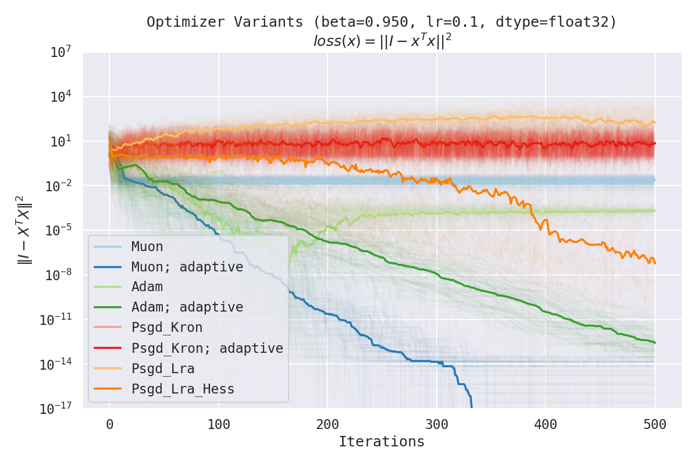
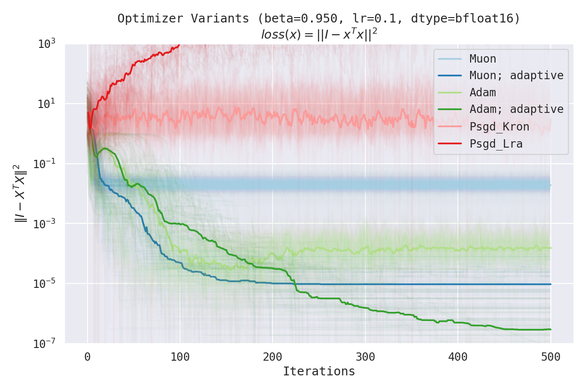
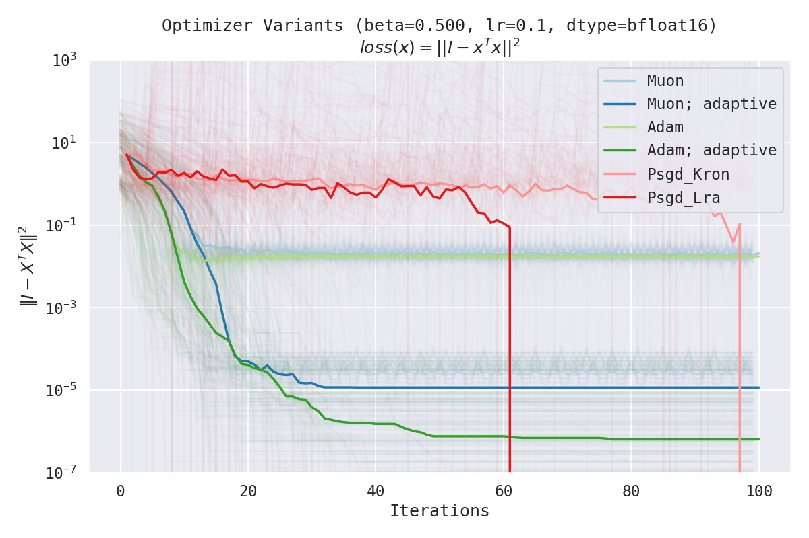
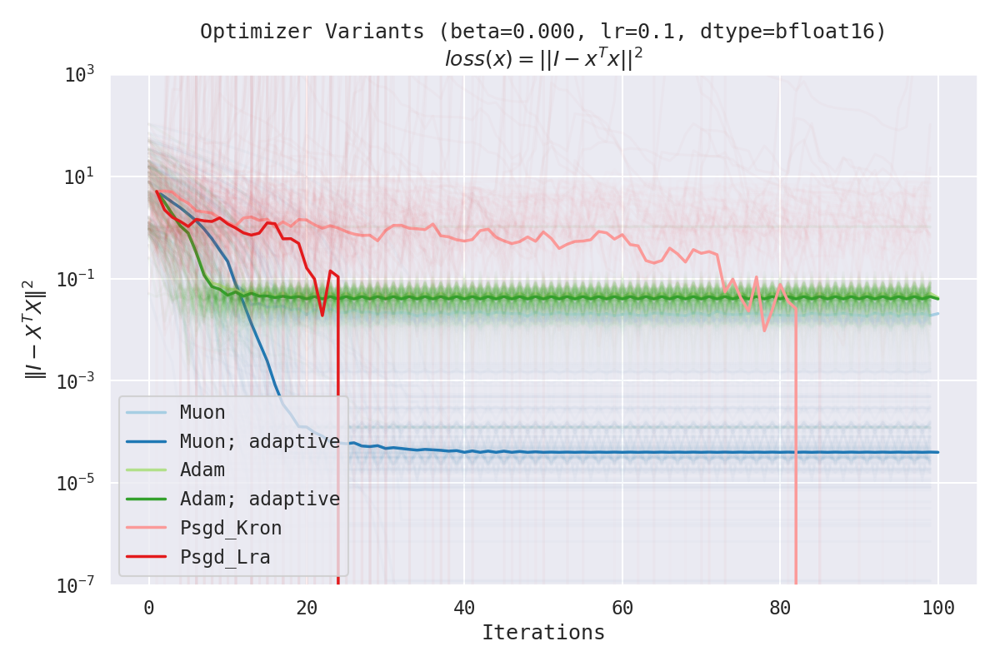
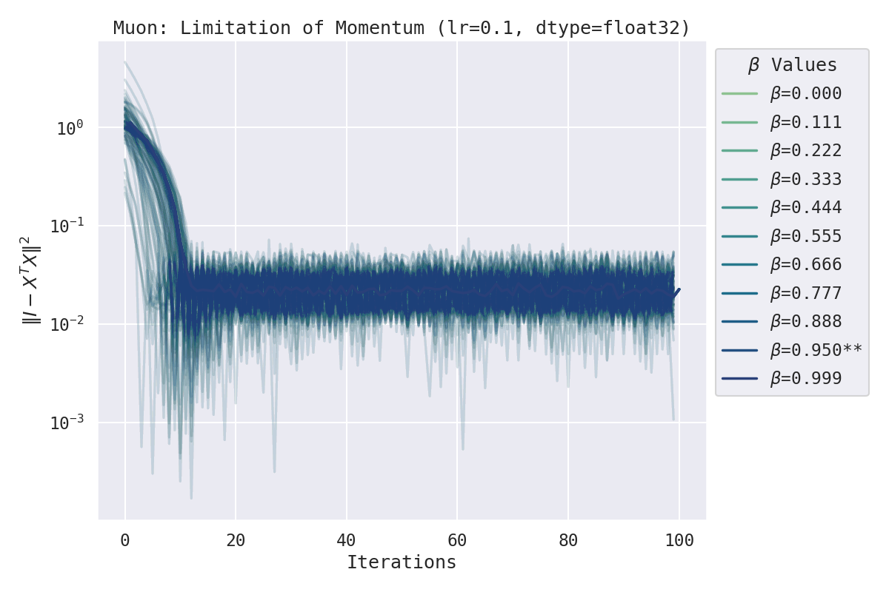

# Dual Norm Correction: Improving Training with One Line of Code

We propose a single-line modification to any (dualizer-based) optimizer that allows the optimizer to adapt to the scale of the gradients as they change during training. This is done by scaling the dualized gradient by the clipped dual norm of the original gradient. Following the [Modular Duality in Deep Learning](https://arxiv.org/abs/2410.21265) framework, we can show that this modification works so long as the dualized gradient is unit-scaled under some choice of norm. For Adam/Lion-variants, the corresponding norm is the Max-of-Max norm and the dualization process scales the elements of the gradient to unit norm. For Muon, the norm is the spectral norm and the dualization process maps the gradient to its nearest orthogonal matrix. Finally, we clip the dual norm to [0., 1.] or [-1., 1.] to prevent divergence.

The following is the one-line diff to the original implementation of [@KellerJordan](https://github.com/KellerJordan)'s [Muon optimizer](https://github.com/KellerJordan/modded-nanogpt). Note however, that all of my benchmarks were done using [my JAX implementation](https://github.com/google-deepmind/optax/pull/1126) and so there may be slight differences in performance & stability between the two implementations.

```diff
def zeropower_via_newtonschulz5(G, steps):
    assert len(G.shape) == 2
    a, b, c = (3.4445, -4.7750,  2.0315)
    X = G.bfloat16()
    # Ensure spectral norm is at most 1
    X = X / (X.norm() + 1e-7)

    if G.size(0) > G.size(1):
        X = X.T

    # Perform the NS iterations
    for _ in range(steps):
        A = X @ X.T
        B = b * A + c * A @ A # adapted from suggestion by @jxbz, @leloykun, and @YouJiacheng
        X = a * X + B @ X
    
    if G.size(0) > G.size(1):
        X = X.T

+    X = torch.einsum('ij,ij->', G.type_as(X), X).clamp(-1., 1.) * X  # Adaptive scaling,`(G * X).sum() * X` == (G.T @ X).trace() * X
    return X
```

## Benchmark Results

In the following benchmarks, we compare the performance Muon, Adaptive Muon, Adam, Adaptive Adam (temporary name; it's just Adam but with the adaptive scaling trick above), and PSGD on the loss function `loss(x) = ||I - x^T x||^2` where `x` is a 2x2 matrix. We picked this loss function because it's simple but very messy.

See [simple_benchmark.ipynb](./simple_benchmark.ipynb) for the code used to generate these plots. If you spot any mistakes, please don't hesitate to raise an issue or PR!

### Muon vs. Adam vs. PSGD


At $\beta = 0.95$ (`float32` & `bfloat16`):




At $\beta = 0.5$ (`float32` & `bfloat16`):




At $\beta = 0.0$ (`float32` & `bfloat16`):




### Effect of Momentum Decay




## Installation

This has already been added to my [PR to @google-deepmind's Optax](https://github.com/google-deepmind/optax/pull/1126). You can install it by running:

```bash
pip install git+https://github.com/leloykun/optax.git@fc--add-muon
```

## Sample Usage

```python
import jax
import jax.numpy as jnp
import optax
from optax.contrib import muon

loss_fn = ...
loss_and_grad_fn = jax.value_and_grad(loss_fn)

optimizer = muon(
    learning_rate=0.1,
    ns_coeffs=(
        (2.9145, -4.3663, 2.4515),
        (2.9131, -4.3582, 2.4446),
        (2.9030, -4.3145, 2.4106),
        (2.8317, -4.0251, 2.1928),
        (2.8392, -3.3535, 1.5149),
    ),
    beta=0.95,
    adaptive=True,
)
opt_state = optimizer.init(params)

def body_fn(values: tuple[jnp.ndarray, optax.OptState], _):
    params, opt_state = values
    loss, grad = loss_and_grad_fn(x, params, slope_weight)
    # Note that Muon is a multi-transform optimizer and so we also need to pass the params to `update`
    updates, opt_state = optimizer.update(grad, opt_state, params)
    new_params = optax.apply_updates(params, updates)
    return (new_params, opt_state), loss

(trained_params, _), losses = jax.lax.scan(body_fn, (params, opt_state), length=num_steps)
```

Note: the optimized coefficients here were obtained via a separate method I'll be sharing soon. It's a WIP and so you should just use the default coefficients for now (i.e. you can omit the `newton_schulz_coeffs` argument above).

## Citation

```bibtex
@misc{dual_norm_correction_2025,
  author = {Franz Cesista},
  title  = {Dual Norm Correction: Improving Training with One Line of Code},
  year   = {2025},
  url    = {https://github.com/leloykun/adaptive-muon},
  note   = {Accessed: 2025-01-04}
}
```
